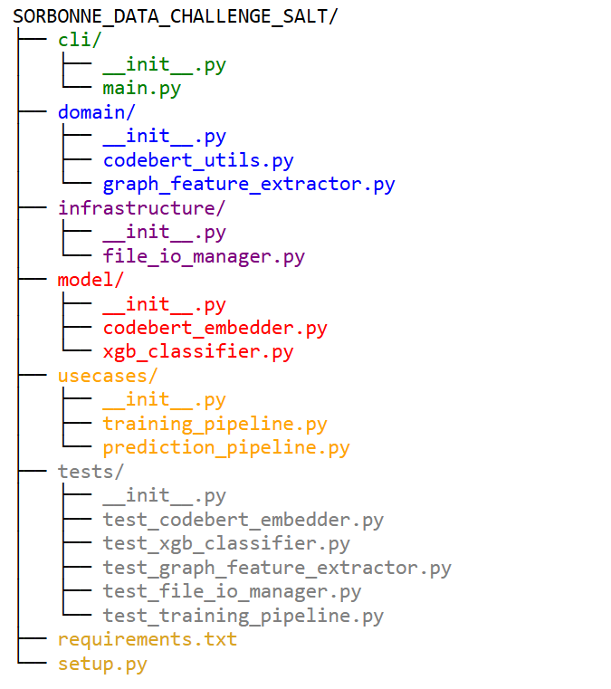

# SORBONNE_DATA_CHALLENGE_SALT

**Veuillez trouvez dans ce repo git :**

- L’extraction d’embeddings avec CodeBERT 

- L’extraction des features des graphes 

- La vectorisation du texte via TF‑IDF et la réduction de dimension par SVD 

- La concaténation finale, l’entraînement d’un modèle XGBoost multilabel avec optimisation des seuils 

- La prédiction sur le test et la génération d'un fichier de soumission

- Ajustement de la prédiction grâce à une méthode de clustering

- Soumission

**Lancer**

- Installer les dépendances après avoir créér votre environnement virtuel
$ pip install -m requierments.txt

- Tester des pipelines après avoir télécharger les données

$ python -m cli.main train --train_csv data/training_set_metadata.csv --train_graph_dir data/folder_training_set --embedding_dir data/instruction_embeddings_grouped_codebert_v2 --output_dir output --sample_size 13000

**Vous trouverez ci-dessous l'oganisation des modules :**

- cli (point d'entrée) : en vert

- domain (logique métier, extraction CodeBERT et features) : en bleu

- infrastructure (gestion des I/O) : en violet

- model (modélisation : CodeBERT embedder, TF‑IDF/SVD, classifieur) : en rouge

- usecases (orchestration du pipeline : entraînement et prédiction) : en orange

- tests (tests unitaires) : en gris

- requirements.txt et setup.py (fichiers de configuration) 

