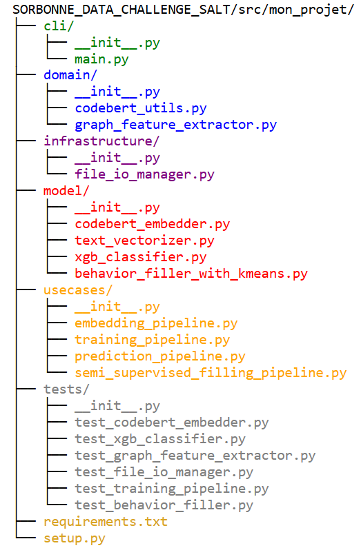

# SORBONNE_DATA_CHALLENGE_SALTmon_projet/

Vous y retrouverez :

- L’extraction d’embeddings avec CodeBERT 

- L’extraction des features des graphes 

- La vectorisation du texte via TF‑IDF et la réduction de dimension par SVD 

- La concaténation finale, l’entraînement d’un modèle XGBoost multilabel avec optimisation des seuils 

- La prédiction sur le test et la génération de la soumission 

cli (point d'entrée) : en vert

domain (logique métier, extraction CodeBERT et features) : en bleu

infrastructure (gestion des I/O) : en violet

model (modélisation : CodeBERT embedder, TF‑IDF/SVD, classifieur) : en rouge

usecases (orchestration du pipeline : entraînement et prédiction) : en orange

tests (tests unitaires) : en gris

requirements.txt et setup.py (fichiers de configuration) 

